# Linux

Linux严格来说指Linux系统内核，但是一般指Linux发行版系统，如Ubuntu，CentOS等都是不同的Linux发行版。
各发行版大同小异，因此，尽管CentOS在科研中用的不多，也强烈推荐[鸟哥的私房菜-基础篇](https://linux.vbird.org/linux_basic/centos7/)开始学习。
而在实际的科研中，推荐使用软件较新的Ubuntu、Fedora等Linux发行版。
以下主要根据Ubuntu为例，介绍一些常用的命令。

## Ubuntu的包管理

### apt和apt-get简介

Ubuntu 16.04 发布时，一个引人注目的新特性便是 apt 命令的引入。其实早在 2014 年，apt 命令就已经发布了第一个稳定版，只是直到 2016 年的 Ubuntu 16.04 系统发布时才开始引人关注。

随着 apt install package 命令的使用频率和普遍性逐步超过 apt-get install package，越来越多的其它 Linux 发行版也开始遵循 Ubuntu 的脚步，开始鼓励用户使用 apt 而不是 apt-get。

那么，apt-get 与 apt 命令之间到底有什么区别呢？如果它们有类似的命令结构，为什么还需要新的 apt 命令呢？是否 apt 真的比 apt-get 更好？普通用户应该使用新的 apt 命令还是坚持旧有习惯继续使用 apt-get 呢？

系统极客将在本文中解释所有这些问题，我们希望本文结束时，你将会有一个更清晰的了解。

**apt与apt-get**

在开始对比 apt 与 apt-get 命令的区别之前，我们先来看看这两个命令的背景，以及它们要试图达到的目的。

Debian 作为 Ubuntu、Linux Mint 和 elementary OS 等 Linux 操作系统的母板，其具有强健的「包管理」系统，它的每个组件和应用程序都内置在系统中安装的软件包中。Debian 使用一套名为 Advanced Packaging Tool（APT）的工具来管理这种包系统，不过请不要把它与 apt 命令混淆，它们之间是其实不是同一个东西。

在基于 Debian 的 Linux 发行版中，有各种工具可以与 APT 进行交互，以方便用户安装、删除和管理的软件包。apt-get 便是其中一款广受欢迎的命令行工具，另外一款较为流行的是 Aptitude 这一命令行与 GUI 兼顾的小工具。

如果你已阅读过我们的 apt-get 命令指南，可能已经遇到过许多类似的命令，如apt-cache、apt-config 等。如你所见，这些命令都比较低级又包含众多功能，普通的 Linux 用户也许永远都不会使用到。换种说法来说，就是最常用的 Linux 包管理命令都被分散在了 apt-get、apt-cache 和 apt-config 这三条命令当中。

apt 命令的引入就是为了解决命令过于分散的问题，它包括了 apt-get 命令出现以来使用最广泛的功能选项，以及 apt-cache 和 apt-config 命令中很少用到的功能。

在使用 apt 命令时，用户不必再由 apt-get 转到 apt-cache 或 apt-config，而且 apt 更加结构化，并为用户提供了管理软件包所需的必要选项。

> 简单来说就是：apt = apt-get、apt-cache 和 apt-config 中最常用命令选项的集合。

**apt与apt-get之间的区别**

!!! note "TL;DR"

    基本没什么区别。

通过 apt 命令，用户可以在同一地方集中得到所有必要的工具，apt 的主要目的是提供一种以「让终端用户满意」的方式来处理 Linux 软件包的有效方式。

apt 具有更精减但足够的命令选项，而且参数选项的组织方式更为有效。除此之外，它默认启用的几个特性对最终用户也非常有帮助。例如，可以在使用 apt 命令安装或删除程序时看到进度条。

apt 还会在更新存储库数据库时提示用户可升级的软件包个数。

如果你使用 apt 的其它命令选项，也可以实现与使用 apt-get 时相同的操作。

虽然 apt 与 apt-get 有一些类似的命令选项，但它并不能完全向下兼容 apt-get 命令。也就是说，可以用 apt 替换部分 apt-get 系列命令，但不是全部。

| apt 命令         | 取代的命令           | 命令的功能                     |
| ---------------- | -------------------- | ------------------------------ |
| apt install      | apt-get install      | 安装软件包                     |
| apt remove       | apt-get remove       | 移除软件包                     |
| apt purge        | apt-get purge        | 移除软件包及配置文件           |
| apt update       | apt-get update       | 刷新存储库索引                 |
| apt upgrade      | apt-get upgrade      | 升级所有可升级的软件包         |
| apt autoremove   | apt-get autoremove   | 自动删除不需要的包             |
| apt full-upgrade | apt-get dist-upgrade | 在升级软件包时自动处理依赖关系 |
| apt search       | apt-cache search     | 搜索应用程序                   |
| apt show         | apt-cache show       | 显示安装细节                   |

当然，apt 还有一些自己的命令：

| 新的apt命令      | 命令的功能                           |
| ---------------- | ------------------------------------ |
| apt list         | 列出包含条件的包（已安装，可升级等） |
| apt edit-sources | 编辑源列表                           |

需要大家注意的是：apt 命令也还在不断发展， 因此，你可能会在将来的版本中看到新的选项。

| apt-get已弃用？                                              |
| ------------------------------------------------------------ |
| 目前还没有任何 Linux 发行版官方放出 apt-get 将被停用的消息，至少它还有比 apt 更多、更细化的操作功能。对于低级操作，仍然需要 apt-get。 |

| 我应该使用apt还是apt-get？                                   |
| ------------------------------------------------------------ |
| 既然两个命令都有用，那么我该使用 apt 还是 apt-get 呢？作为一个常规 Linux 用户，系统极客建议大家尽快适应并开始首先使用 apt。不仅因为广大 Linux 发行商都在推荐 apt，更主要的还是它提供了 Linux 包管理的必要选项。 |

最重要的是，apt 命令选项更少更易记，因此也更易用，所以没理由继续坚持 apt-get。


小结

最后结大家提供两点使用上的建议：

apt 可以看作 apt-get 和 apt-cache 命令的子集, 可以为包管理提供必要的命令选项。
apt-get 虽然没被弃用，但作为普通用户，还是应该首先使用 apt。


### 更新apt源

```bash
sudo apt-get update
```

该命令的作用：这个命令，会访问源列表里的每个网址，并读取软件列表，然后保存在本地电脑。软件包管理器里看到的软件列表，都是通过update命令更新的。

update后，可能需要upgrade一下。


```csharp
sudo apt-get upgrade
```

这个命令，会把本地已安装的软件，与刚下载的软件列表里对应软件进行对比，如果发现已安装的软件版本太低，就会提示你更新。如果你的软件都是最新版本，会提示：

```undefined
升级了 0 个软件包，新安装了 0 个软件包，要卸载 0 个软件包，有 0 个软件包未被升级。
```

总而言之，update是更新软件列表，upgrade是更新软件。


## - vim编辑器的使用 

### **1 安装vim**

> **命令** 
>
> ```
> sudo apt install vim
> ```
>
> 
>
> 
>
> > 可能需要更新一下apt源.  新的ubuntu系统需要更新一下apt源才可.


### **2 基本用法**

> - 打开文件:
>
>   ```
>   vim 文件名
>   
>   ps: 如果不存在目标文件的话, 就会创建一个新的文件.
>   ```
>
> - 进入insert模式
>
>   ```
>   按下字母 i
>   ```
>
> - 保存
>
>   > 完成编辑之后,按ESC,退出insert模式.
>   >
>   > 退出insert模式之后, 输入 :  ,  紧接着可以输入命令. 再按下回车.  如下面的wq! ,  就是保存并退出.
>   >
>   > ```
>   > 文件的保存和退出。在命令模式下输":"符号，最下方会出现命令语句操作
>   >   1):w  保存；
>   >   2):w  filename 另存为filename；
>   >   3):wq! 保存退出；
>   >   4):wq! filename 注：以filename为文件名保存后退出；
>   >   5):q! 不保存退出；
>   >   6):x 应该是保存并退出 ，功能和:wq!相同
>   > ```
>   >
>   > 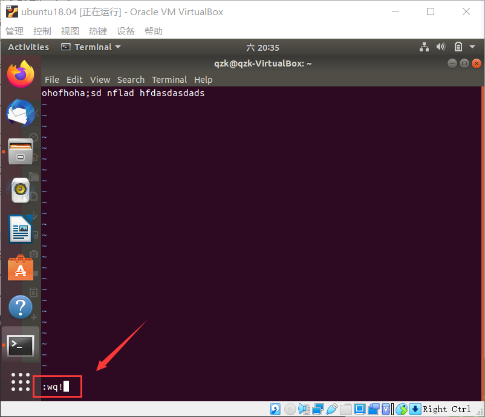


### 3 文本的复制粘贴


`i命令：`进入编辑模式，此时进入编辑文档的状态，此时不能再使用别的vim命令，除非按`esc`退出编辑模式才行。

```
1. 选定文本块。使用v进入可视模式，移动光标键选定内容。 

2.复制的命令是y，即yank（提起） ，常用的命令如下： 
    y      在使用v模式选定了某一块的时候，复制选定块到缓冲区用； 
    yy    复制整行（nyy或者yny ，复制n行，n为数字）； 
    y^   复制当前到行头的内容； 
    y$    复制当前到行尾的内容； 
    yw   复制一个word （nyw或者ynw，复制n个word，n为数字）； 
    yG    复制至档尾（nyG或者ynG，复制到第n行，例如1yG或者y1G，复制到档尾）  
    
3. 剪切的命令是d，即delete，d与y命令基本类似，所以两个命令用法一样，包括含有数字的用法.  
    d      剪切选定块到缓冲区； 
    dd    剪切整行 
    d^    剪切至行首 
    d$     剪切至行尾 
    dw    剪切一个word 
    dG     剪切至档尾  
    
4. 粘贴的命令式p，即put（放下） 
    p      小写p代表贴至游标后（下），因为游标是在具体字符的位置上，所以实际是在该字符的后面 
    P      大写P代表贴至游标前（上） 
    整行的复制粘贴在游标的上（下）一行，非整行的复制则是粘贴在游标的前（后）
```


### 4 不小心按下了ctrl+s

> 有时会习惯性地写完程序后按下“ctrl+s”，潜意识地认为这是“保存”
>
> 反应过来后发觉不对，又开始按esc，结果发现按啥都没反应了
>
> 查找资料后得知，
>
> 这是因为“ctrl+s”的组合快捷键在vim中是“阻塞后续输入”的作用
>
> 可以按“ctrl+q”以取消


## - 切换到root用户

使用`su -`命令，再输入root用户的密码即可进入root用户。	


## - ls命令各种文件的颜色

> 白色：表示普通文bai件du
> 蓝色：表示目录
> 绿色：表示可执行文件
> 红色：表示压缩文件
> 浅蓝色：链接文件
> 红色闪烁：表示链接的文件有问题
> 黄色：表示设备文件
> 灰色：表示其他文件


## - windows传文件到linux服务器上

1. **下载pscp**

   - 从http://www.chiark.greenend.org.uk/~sgtatham/putty/download.html下载pscp

   - 将其放入windows的system32 文件夹下。

   - 下载的时候，选择 .exe 文件进行下载。

    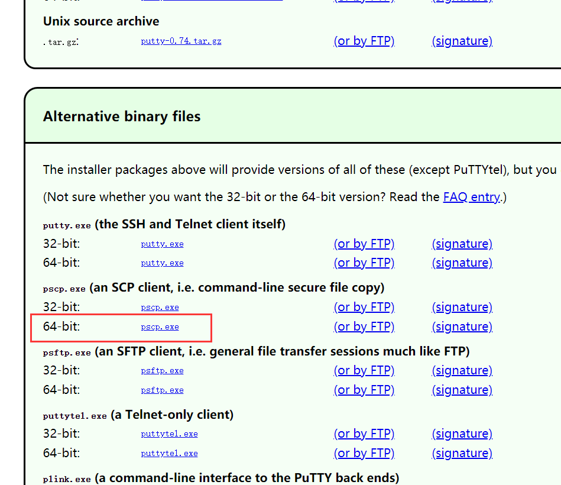


2. 在windows cmd中写命令传文件：

   ```
   scp windows文件路径 linux用户名@服务器ip:上传目标地址
   ```

   eg:

   ```
   scp C:\Users\15123\Downloads\zlib-1.2.11.tar.gz chenlei@210.28.134.151:/home/chenlei/temp
   ```


## - 从链接下载文件

```
wget http://www.zlib.net/zlib-1.2.8.tar.gz
```

目前尝试了, 这种以tar.gz结尾的是可以用的


## - 查看本机ip地址

 **ps:** 已经写成百度经验。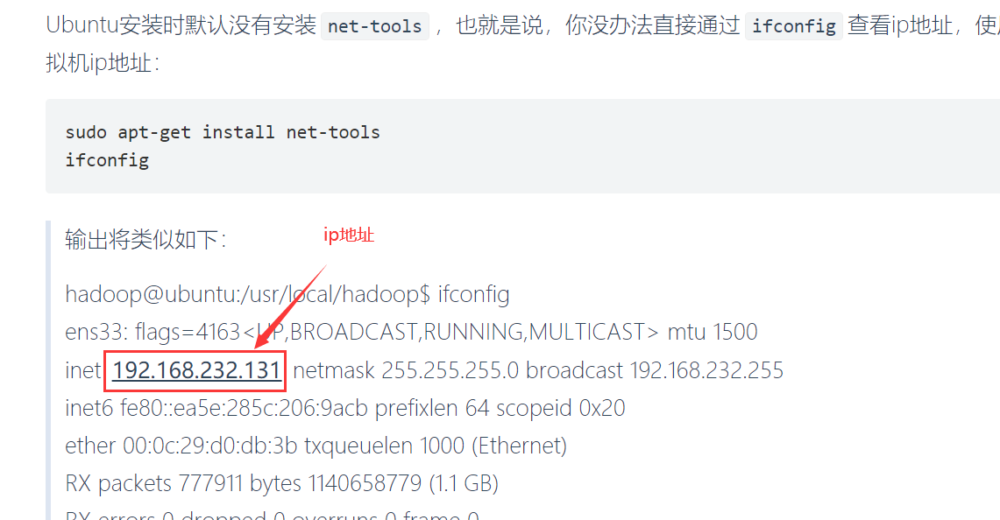s


## - 开启ssh服务

https://blog.csdn.net/dd15923021755/article/details/89333076


## - ssh连接远程服务器

```
方法：
1.安装SSH客户端：sudo apt-get install ssh 或者 sudo apt-get install openssh-client

2.确认安装成功：ssh-keygen  (这步貌似不需要，输入这个命令后，还要输入一些东西，应该不用感觉)

3.连接其他电脑（例子）：ssh root@172.20.0.80

4.输入172.20.0.80的密码即可连接到其他电脑。
```

## - 关闭ssh连接服务器程序也继续运行

**nohup执行：**

如果原本的命令是 *command*，则在前面加上nohup关键词即能实现目标功能：nohup *command*

如原本命令：python train.py，改完之后 nohup python train.py。

输入完按下回车，则可以在终端继续操作别的东西了，此时运行train.py的输出就不会输出到终端了，而是将输出都保存在一个叫 nohup.out的文件里。


**读取nohup中的日志文件：**

如果想随时开一个终端看训练到哪了，则需要查看nohup的日志。

具体就是采用 tail命令，在深度学习训练过程中，主要有两种用法：

```sh
tail filename  # 这个会输出filename文件的后10行

tail -f filename  # 该命令会将从此刻开始，新存到nohup.out中的行不断地输出出来，除非按下ctrl+c中止这条tail命令。这种方式相当于在实时查看训练的输出。
```


如果想自己指定输出保存到哪个文件夹，则需要继续研究。


## - 使用wget下载谷歌网盘文件

1. **下载小文件**

   > ```bash
   > wget --no-check-certificate ‘https://docs.google.com/uc?export=download&id=FILEID’ -O FILENAME
   > ```
   >
   > 替换对应的FILEID即可，FILENAME自己命名。
   > FILEID是Google drive公开分享的链接中ID后面的，例如：
   >
   > ```bash
   > https://drive.google.com/open?id=ThisIsFileID
   > ```
   >
   > 如果下载中断了，想要继续下载，可以在wget后面添加 -c 参数


2. **下载大文件**
   
   > 因为Google drive的大文件，无法通过安全查杀
   >
   > ```bash
   > wget --load-cookies /tmp/cookies.txt "https://docs.google.com/uc?export=download&confirm=$(wget --quiet --save-cookies /tmp/cookies.txt --keep-session-cookies --no-check-certificate 'https://docs.google.com/uc?export=download&id=FILEID' -O- | sed -rn 's/.*confirm=([0-9A-Za-z_]+).*/\1\n/p')&id=FILEID" -O FILENAME && rm -rf /tmp/cookies.txt
   > 1
   > ```
   >
   > 同样替换其中的FILEID和FILENAME即可。注意FILEID有两处。
   
   

## - 查看进程命令 ps

Linux ps （英文全拼：process status）命令用于显示当前进程的状态，类似于 windows 的任务管理器

**参数说明：**

```
-e 显示所有进程。
-f 全格式。
```


**实战1：查看指定PID的进程的细节信息**

```cmd
ps -f -p {pid_value}
```

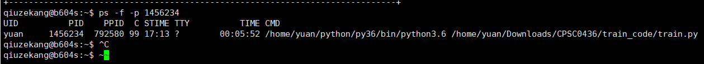


**实战2：查找包含xxx关键字的进程信息**

```bash
ps -ef|grep xxx
```

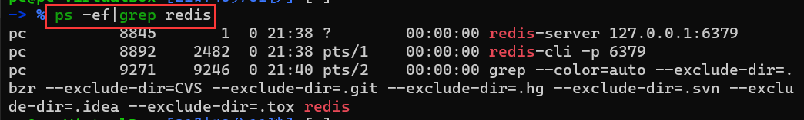

中间的|是管道命令 是指ps命令与grep同时执行。grep命令是查找，是一种强大的文本搜索工具，它能[使用正则表达式](https://www.baidu.com/s?wd=使用正则表达式&tn=44039180_cpr&fenlei=mv6quAkxTZn0IZRqIHckPjm4nH00T1d9uWD3PhP9n1b4m1nduAcz0ZwV5Hcvrjm3rH6sPfKWUMw85HfYnjn4nH6sgvPsT6KdThsqpZwYTjCEQLGCpyw9Uz4Bmy-bIi4WUvYETgN-TLwGUv3EPjfvrHnzPWT3)搜索文本，并把匹配的行打印出来。


# ps命令

## - 更换为清华镜像

打开终端（Open Terminal） 

**step1 将系统自带的该文件做个备份：** 

```cmd
sudo cp /etc/apt/sources.list /etc/apt/sources.list.backup
```

**step2 修改配置：**

使用如下命令打开文件：

```
sudo gedit /etc/apt/sources.list
```

 将下面的内容粘贴到打开文件的最前面，全部粘贴过去，保存，并关闭。

ps: 也可以从如下网址，获得指定系统版本的镜像源 https://mirrors.tuna.tsinghua.edu.cn/help/ubuntu/  

```txt
# 默认注释了源码镜像以提高 apt update 速度，如有需要可自行取消注释
deb https://mirrors.tuna.tsinghua.edu.cn/ubuntu/ bionic main restricted universe multiverse
# deb-src https://mirrors.tuna.tsinghua.edu.cn/ubuntu/ bionic main restricted universe multiverse
deb https://mirrors.tuna.tsinghua.edu.cn/ubuntu/ bionic-updates main restricted universe multiverse
# deb-src https://mirrors.tuna.tsinghua.edu.cn/ubuntu/ bionic-updates main restricted universe multiverse
deb https://mirrors.tuna.tsinghua.edu.cn/ubuntu/ bionic-backports main restricted universe multiverse
# deb-src https://mirrors.tuna.tsinghua.edu.cn/ubuntu/ bionic-backports main restricted universe multiverse
deb https://mirrors.tuna.tsinghua.edu.cn/ubuntu/ bionic-security main restricted universe multiverse
# deb-src https://mirrors.tuna.tsinghua.edu.cn/ubuntu/ bionic-security main restricted universe multiverse
 
# 预发布软件源，不建议启用
# deb https://mirrors.tuna.tsinghua.edu.cn/ubuntu/ bionic-proposed main restricted universe multiverse
# deb-src https://mirrors.tuna.tsinghua.edu.cn/ubuntu/ bionic-proposed main restricted universe multiverse
```

**step3 更新**

更新源: sudo apt-get update 
更新软件: sudo apt-get upgrade 


# 二、文件操作命令行

\- 查看所有文件：

1. **查看文件：**

   > ls ：列出所有文件和文件夹(不包括隐藏文件)
   >
   > ls -a : 包括隐藏文件
   >
   > ls -al  :  列出所有文件夹和文件，包括文件的详细信息
   >
   > ls -F : 列出所有文件，文件夹的话后面会有 /，使用此命令可以轻易看出哪些是文件夹哪些是文件。


2. **删除文件：**

   > rm -f 文件路径：删除文件
   >
   > rm -rf 文件夹路径：删除整个文件夹
   >
   >  
   >
   > ==参数理解：==
   >
   > `-i`: 删除前逐一询问确认。
   >
   > `-f`: 强制删除：即使原档案属性设为唯读，亦直接删除，无需逐一确认。
   >
   > `-r`: 递归删除：将目录及以下之档案亦逐一删除。

   

3. **复制文件/文件夹：**

   > cp -rf  源文件夹/*  目标文件夹
   >
   > eg：
   >
   > ```
   > cp -rf /home/wwwroot/sinozzz/* /home/wwwroot/sinozzz123
   > 把/home/wwwroot/sinozzz里面的文件和文件夹等复制到home/wwwroot/sinozzz123目录下
   > ```

4. **剪切文件/文件夹：**

   > mv 源文件路径  目标文件路径
   >
   > eg：
   >
   > ```
   > mv /home/wwwroot/sinozzz123/music/1.mp3 /home/wwwroot/sinozzz123/abc
   > 
   > 将/home/wwwroot/sinozzz123/music/目录下的1.mp3文件剪切到/home/wwwroot/sinozzz123/abc目录下，执行下面的
   > ```

5. **创建文件夹：**

   > mkdir xxx
   
6. **压缩与解压文件：**

   
   
   > 解压.zip文件：
   >
   > 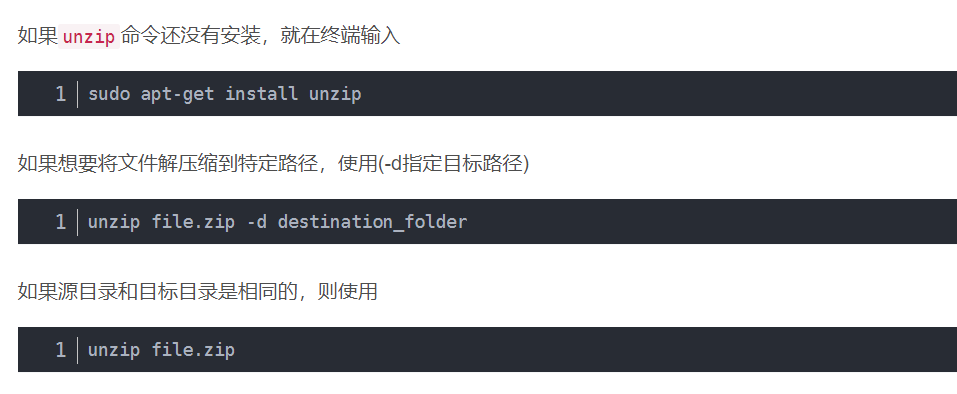
   >
   > ```bash
   > 01-.tar格式
   > 解包：[＊＊＊＊＊＊＊]$ tar xvf FileName.tar
   > 打包：[＊＊＊＊＊＊＊]$ tar cvf FileName.tar DirName（注：tar是打包，不是压缩！）
   > 02-.gz格式
   > 解压1：[＊＊＊＊＊＊＊]$ gunzip FileName.gz
   > 解压2：[＊＊＊＊＊＊＊]$ gzip -d FileName.gz
   > 压 缩：[＊＊＊＊＊＊＊]$ gzip FileName
   > 
   > 03-.tar.gz格式
   > 解压：[＊＊＊＊＊＊＊]$ tar zxvf FileName.tar.gz
   > 压缩：[＊＊＊＊＊＊＊]$ tar zcvf FileName.tar.gz DirName
   > # 参数说明：
   > z : 表示 tar 包是被 gzip 压缩过的，所以解压时需要用 gunzip 解压
   > x : 从 tar 包中把文件提取出来
   > v : 显示详细信息
   > f xxx.tar.gz :  指定被处理的文件是 xxx.tar.gz
   > ```
   
7. **统计文件夹中文件数量**

   > ##### 查看当前目录下的文件数量（不包含子目录中的文件）
   >
   > ```
   > ls -l|grep "^-"| wc -l
   > ```
   >
   > ##### 查看当前目录下的文件数量（包含子目录中的文件） 注意：R，代表子目录
   >
   > ```
   > ls -lR|grep "^-"| wc -l
   > ```
   >
   > ##### 查看当前目录下的文件夹目录个数（不包含子目录中的目录），同上述理，如果需要查看子目录的，加上R
   >
   > ```
   > ls -l|grep "^d"| wc -l
   > ```
   >
   > ##### 查询当前路径下的指定前缀名的目录下的所有文件数量
   >
   > 例如：统计所有以“20161124”开头的目录下的全部文件数量
   >
   > ```
   > ls -lR 20161124*/|grep "^-"| wc -l
   > ```
   >
   >  
   >
   > **一波对命令的解析：**
   >
   > 对每个命令参数做一下说明备注： 
   > `ls -l` 
   > 该命令表示以长列表输出指定目录下的信息（未指定则表示当前目录），R代表子目录中的“文件”，这个“文件”指的是目录、链接、设备文件等的总称
   >
   > `grep "^d"`表示目录，`"^-"`表示文件
   >
   > `wc -l` 
   > 表示统计输出信息的行数，因为经过前面的过滤已经只剩下普通文件，一个目录或文件对应一行，所以统计的信息的行数也就是目录或文件的个数


# 三、软件安装

## - Chrome

ps：此条笔记已经发布在百度经验上了。


**Step1：**

打开Ubuntu自带的 FireFox 浏览器，输入图中网址，进入chrome官网。进入官网后，点击网站中间的 “下载Chrome”按钮。

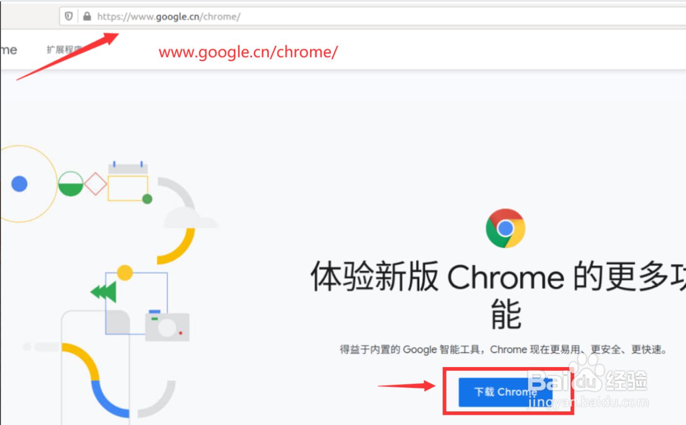


**Step2：**

下载 **.deb包**，双击安装即可。


## - Anaconda

==ps：如果在别的机器上有安装了 anaconda，可直接把那个文件夹复制进来，然后按照下面的第四步配置一下环境就行。==

1. **下载 安装文件，linux的安装文件是 .sh 脚本。**

    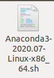

2. **安装**

   ```
   bash 脚本名称
   ```

   ps：如果这里使用的是 sudo bash 脚本名称 的话，安装时，默认目录就是root目录下。

3. **注意安装路径问题**

   >  安装时，看终端的提示往下按确定。在 同意协议之后，要注意下面这个路径问题。如果不是安在home/qzk/anaconda3。自己指定为用户名下。
   >
   >  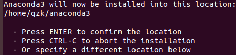

4. **配置环境变量**

   > ①
   >
   > ```
   > vim ~/.bashrc
   > ```
   >
   > ②在最底下插入：
   >
   > ```bash
   > export PATH="/home/qzk/anaconda3/bin:$PATH"  # 此行要根据实际的安装路径来
   > ```
   >
   > ③
   >
   > ```
   > source ~/.bashrc
   > ```

5. **测试**

   > 执行一下python命令，要是没报错，就正确了。
   >
   >  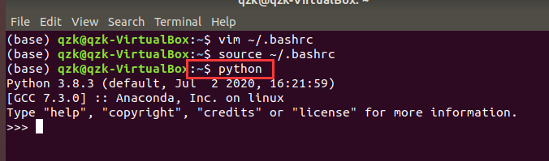


## - pycharm

1. **下载**

   在pycharm官网(https://www.jetbrains.com/pycharm/download/#section=linux)选择professional点击下载。

2. **安装**

   解压文件,将其中的pycharm-2020.1.3放在下载根目录下,进入pycharm-2020.1.3/bin,执行.sh    文件开始安装:

   ```
   sh ./pycharm.sh
   ```

3. **创建应用图标**

   ```
   cd /usr/share/applications
   sudo gedit pycharm.desktop
   ```

4. **编辑快捷方式**

   ```
   [Desktop Entry]
   Version=1.0
   Type=Application
   Name=Pycharm
   Icon=/home/chenlei/下载/pycharm-2020.1.3/bin/pycharm.png
   # 注意此处的路径
   Exec=sh /home/chenlei/下载/pycharm-2020.1.3/bin/pycharm.sh
   # 注意此处的路径
   MimeType=application/x-py;
   Name[en_US]=pycharm
   ```

## - git

```
sudo apt-get install git
```

输入以上命令即可完成git安装。安装完之后，使用git命令试一下，如果弹出很多东西就算安装成功。

以下这个网址的git安装教程设计密钥什么的，还不太懂。

https://www.cnblogs.com/lxm20145215----/p/5905765.html


## - 实现可以输入中文

刚安装完可能无法输入中文，依次：设置->区域和语言，再点击“管理已安装的语言”之后，就会弹出让安装语言相关的模块。点击更新/安装即可。

不知道这个网址可以不，先放到这，到时候试试：

 https://www.cnblogs.com/YMaster/p/8967233.html 


## - typora

 https://www.typora.io/#linux


## -gcc安装

默认的Ubuntu存储库包含一个名为build-essential的元包，它包含GCC编译器以及编译软件所需的许多库和其他实用程序。因此，安装了build-essential就安装了gcc。

```bash
# step1 
sudo apt update

# step2
sudo apt install build-essential

# step3 查看gcc版本，若正常输出，则算安装成功
gcc --version
```


# 四、虚拟机相关

## - 虚拟机输完密码打不开了

解决方案：应该知道，vmbox中一个虚拟机就是一个 .vdi 文件，重新创建一个虚拟机，然后选择之前那个虚拟机的vdi文件即可。

 =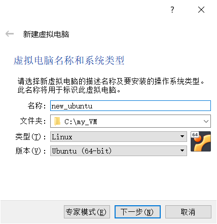

 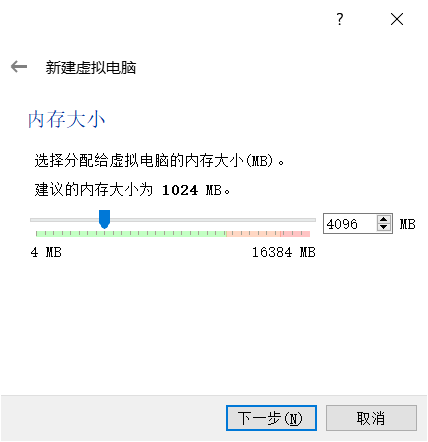

 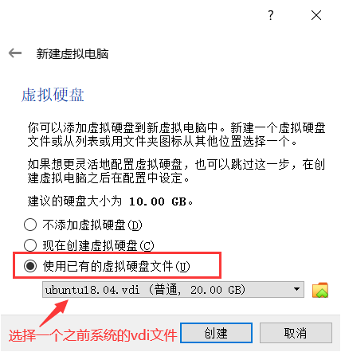

## - 主机与虚拟机共享剪切板（virtual box）

 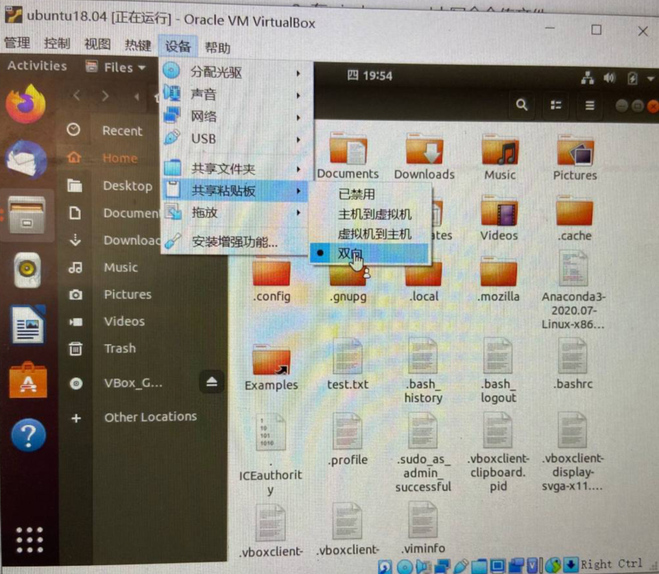

 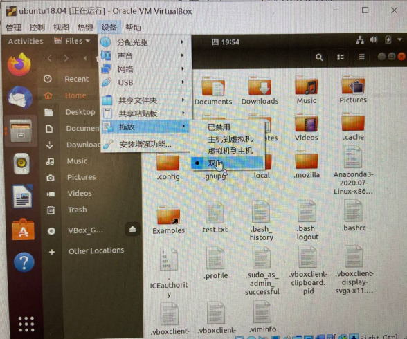

 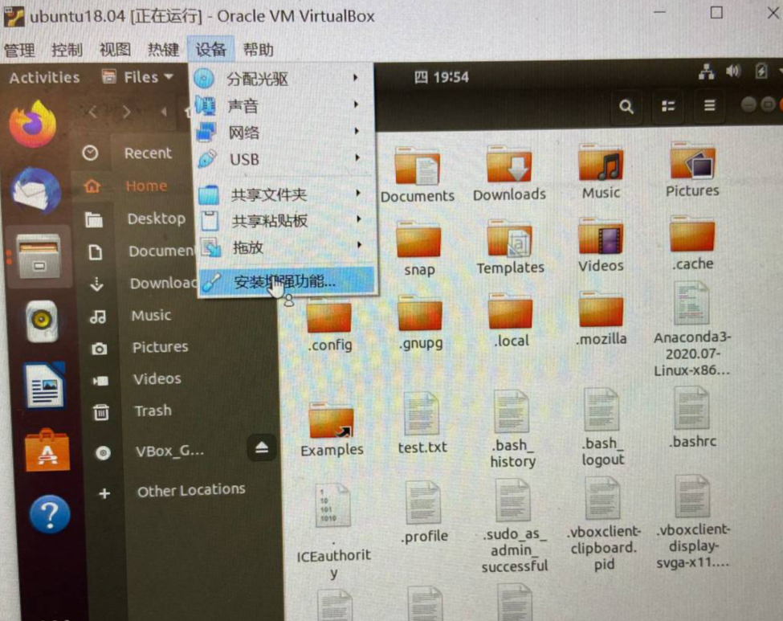

执行完这三步之后，在linux虚拟机里会提示要安装某个东西。确认一下，等待安装完成之后重启，就可以直接从windows往里拖拽文件夹了。

 

## 五、搭建自己的服务器

### 1 安装ssh

**1.1 安装ssh**

https://blog.csdn.net/wgc0802402/article/details/91046196?utm_medium=distribute.pc_relevant.none-task-blog-baidujs_baidulandingword-0&spm=1001.2101.3001.4242

**1.2 如果没有开机自启ssh服务，那么**

```sh
设置开机自启动
sudo systemctl enable ssh
关闭ssh开机自动启动命令
sudo systemctl disable ssh
单次开启ssh
sudo systemctl start ssh
单次关闭ssh
sudo systemctl stop ssh
设置好后重启
reboot
```


### 2 frp实现内网穿透

使用screen技术，让frp命令运行在一个独立的screen，然后再让此screen变成detached状态。


**step1：创建一个screen**

这里将这个screen命名为 myssh。

 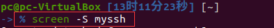

创建完成之后，就会进入这个screen，如下图：

 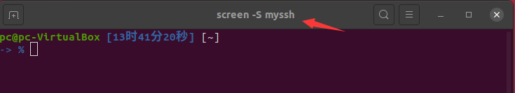


**step2：在创建的screen窗口运行frp命令**

 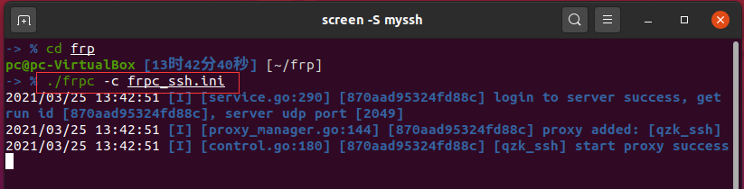


**step3：将运行frp的screen给detached了**

在另一个命令行窗口将名称为`myscreen`的窗口给detached了，这样运行frpc命令的那个窗口就在后台运行了。

 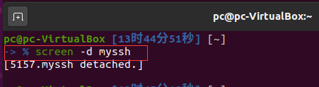


**step4：手动关闭frp**

如果要关闭frpc的进程：

1. 先连回那个myssh的screen，使用命令`screen -r myssh`。
2. 在那个界面`ctrl+C`结束frpc的进程。
3. 按下`ctrl+d`关掉那个screen，删除不必要的screen。

### 3 samba

#### 添加新用户

1. 在Linux服务器根目录下（黄色背景部分是需替换部分：换成你自己的用户名）

```
sudo smbpasswd -a username
```

2. 修改samba配置文件

```csharp
sudo vi /etc/samba/smb.conf
```

3. 在smb.conf文件末尾处添加：

```csharp
[username]
comment = username share
path = /home/username
available = yes
browseable = yes
public = yes
writable = yes
valid users = username
```

 

# linux常用命令练习


## 零 通用

1. 查看命令的帮助文档。这里请实践查看 mkdir命令的帮助文档。
2. 


## 一 目录管理相关

==**ls**==

1. 列出当前目录所有文件，要求不要输出详细信息，也不要输出隐藏文件。

   

2. 列出当前目录所有文件，要求不要输出详细信息，但输出隐藏文件。

   

3. 列出当前目录所有文件，要求输出详细信息，且要隐藏文件也要同时输出。要求也要掌握快捷命令


==**cd**==

1. 进入Downloads目录

   

==**mkdir**==

1. 创建一个名为dir_test的文件夹

   

2. 一条命令实现创建 dir1/dir2/dir3 这个文件夹

   


==**pwd**==

1. 打印当前目录的路径

   

==**cp**==

1. 进入任意一个文件夹，将一个文件复制到Downloads文件夹里。

   

2. 进入任意一个文件夹，将一个文件复制到Downloads文件夹里，复制过去的时候，重命名为 new_name.后缀

   

3. 两次将一个文件复制到Downloads文件夹里，复制过去的时候，要求第二次复制过去的时候，要提示 "是否覆盖"?

   

==**mv**==

1. 进入任意一个文件夹，将一个文件移动到Downloads文件夹里。

   

2. 进入任意一个文件夹，将一个文件移动到Downloads文件夹里，移动过去的时候，重命名为 new_name.后缀

   

3. 在两个不同文件夹中，分别创建一个名字相同的文件。将其中一个文件夹中的文件移动到另外一个文件夹，要求会弹出提示询问是否要移动？

   

4. 将当前目录下某个文件重命名为new_name.后缀名。

   


## 二 读写文件内容

==**torch**==

1. 创建一个名为 new-file.txt文件。

   

==**echo**==

1. 在不打开vim的情况下，向 new-file.txt 文件中输入内容。即在命令行中，向文本文件中输入内容。

   

==**cat与tac**==

1. 找到一个具有多行文本的文件，将文件内的内容都输出到控制台。分别按行正序输出和按行倒序输出。

   

2. 将一个文本文件中的内容输出到命令行，输出时带上行号，空白行也标记行号。

   

3. 将一个文本文件中的内容输出到命令行，输出时带上行号，空白行不标记行号。

   

==**head**==

1. 将一个文本文件的前5行输出到控制台。

   

==**tail**==

2. 将一个文本文件的后5行输出到控制台。

==**more**==

1. 使用more命令打开一个内容较大的文本文件，并向下翻页和向上翻页。

   

2. 使用more命令打开一个内容较大的文本文件，并向按行向下翻动。

   

3. 使用more命令打开一个内容较大的文本文件，不断向下翻页/翻行，直到内容显示完自动退出more命令。

   

==**less 程序**==

**原理讲解：**

1. 使用more命令打开一个内容较大的文本文件，并向下翻页和向上翻页。

   

2. 使用less命令打开一个内容较大的文本文件，并向按行向下和向上翻动。

   

3. 使用less命令打开一个内容较大的文本文件，并搜索文本中的某个关键词，然后聚焦到文档中此关键词的下一处，再聚焦到文档中此关键词的上一处。

   

4. 使用less命令打开一个内容较大的文本文件，然后退出less程序。

   

5. 使用less命令打开一个内容较大的文本文件，要求可以显示行号。

   

   

# linux常用命令练习-答案

## 零 通用

1. 查看命令的帮助文档。这里请实践查看 mkdir命令的帮助文档。

   ```bash
   mkdir --help	
   ```

## 一 目录管理相关

首先到达~目录

==**ls**==

1. 列出当前目录所有文件，要求不要输出详细信息，也不要输出隐藏文件。

   ```bash
   ls
   ```

2. 列出当前目录所有文件，要求不要输出详细信息，但输出隐藏文件。

   ```bash
   ls -a
   ```

3. 列出当前目录所有文件，要求输出详细信息，且要隐藏文件也要同时输出。要求也要掌握快捷命令

   ```bash
   ls -al
   ll # 快捷命令
   ```

==**cd**==

1. 进入Downloads目录

   ```bash
   cd Downloads
   ```

==**mkdir**==

1. 创建一个名为dir_test的文件夹

   ```bash
   mkdir dir_test
   ```

2. 一条命令实现创建 dir1/dir2/dir3 这个文件夹。

   ```bash
   mkdir -p dir1/dir2/dir3   # p时parent的缩写
   ```
   
   说明：-p 表示如果文件夹不存在的话，则创建文件夹。比如上面的命令表示在dir1中的dir2中创建一个名为dir3的文件夹。由于命令带了参数 -p，则如果dir1不存在，则会先创建dir1，接着如果dir2不存在，则会创建dir2，然后最后再在dir2中创建dir3。


==**pwd**==

1. 打印当前目录的路径

   ```bash
   pwd
   ```


==**cp**==

1. 进入任意一个文件夹，将一个文件复制到Downloads文件夹里。

   ```bash
   cp xxx ~/Downloads
   ```

2. 进入任意一个文件夹，将一个文件复制到Downloads文件夹里，复制过去的时候，重命名为 new_name.后缀

   ```bash
   cp xxx ~/Downloads/new_name.后缀
   ```

3. 两次将一个文件复制到Downloads文件夹里，复制过去的时候，要求第二次复制过去的时候，要提示 "是否覆盖"?

   ```bash
   cp xxx ~/Downloads
   cp -i xxx ~/Downloads  # 说明：如果不加i的话，就直接覆盖了。i是interactive的缩写
   
   ```
   
4. 

==**rm**==

1. 删除一个文件，采用默认的形式删除，即命令不必加任何参数。

   ```bash
   rm 文件名
   ```

   

2. 删除一个文件，要求删除时无论这个文件是否存在，不用询问，直接删除。

   ```bash
   rm -f 文件名
   ```

   

3. 删除一个文件，删除文件时，询问是否删除，即开启交互模式。

   ```bash
   rm -i 文件名
   ```

   

4. 删除一个文件夹及其中的内容

   ```bash
   rm -r  # r是recursion的缩写，递归之意。 
   ```

   

5. 删除一个文件夹及其中的内容，要求删除时无论这个文件夹是否存在，不用询问，直接删除。

   ```bash
   rm -rf  
   ```

   **综上：**最常用的两个命令应该是 `rm 文件名`和`rm -r 文件夹`，分别是删除一个文件和一个文件夹。因为不加f的话，若是空文件夹还会给提示文件夹不存在，有助于认清实际情况。


==**mv**==

1. 进入任意一个文件夹，将一个文件移动到Downloads文件夹里。

   ```bash
   mv xxx ~/Downloads
   ```

2. 进入任意一个文件夹，将一个文件移动到Downloads文件夹里，移动过去的时候，重命名为 new_name.后缀

   ```bash
   mv xxx ~/Downloads/new_name.后缀
   ```

3. 在两个不同文件夹中，分别创建一个名字相同的文件。将其中一个文件夹中的文件移动到另外一个文件夹，要求会弹出提示询问是否要移动？

   ```bash
   torch a.txt   # 在某个文件夹创建a.txt文件
   torch a.txt   # 在另一个文件夹中也创建a.txt文件 
   mv -i xxx ~/Downloads/new_name.后缀  # 说明：如果不加i的话，就直接覆盖了
   ```

4. 将当前目录下某个文件重命名为new_name.后缀名。

   ```bash
   mv xxx new_name.后缀名  # mv的这种用法就相当于是重命名了文件
   ```


## 二 读写文件内容

==**torch**==

**原理讲解：**

> Linux touch命令用于修改文件或者目录的时间属性，包括存取时间和更改时间。若文件不存在，系统会建立一个新的文件。  目前只用torch命令来创建文件，没有用于修改文件属性。等需要的时候再用。

1. 创建一个名为 new-file.txt文件。

   ```bash
   touch new-file.txt
   ```

   

==**echo**==

1. 在不打开vim的情况下，向 new-file.txt 文件中输入内容。即在命令行中，向文本文件中输入内容。

   ```bash
   echo "this is some content">>new-file.txt
   # 说明：1 该语句是向文件中追加内容. 2 将内容追加到文件中后，会自动添加换行。
   ```
   
   

==**cat与tac**==

1. 找到一个具有多行文本的文件，将文件内的内容都输出到控制台。分别按行正序输出和按行倒序输出。

   ```bash
   cat 文件名   # 按行正序输出
   tac 文件名   # 按行倒序输出
   ```

2. 将一个文本文件中的内容输出到命令行，输出时带上行号，空白行也标记行号。

   ```bash
   cat -n 文件名  # n是number的缩写
   ```

   

3. 将一个文本文件中的内容输出到命令行，输出时带上行号，空白行不标记行号。

   ```bash
   cat -b 文件名  #b是 number-nonblank 的缩写
   # 说明：实测的话，感觉和-n一样。空行也给输出了。
   ```
   
    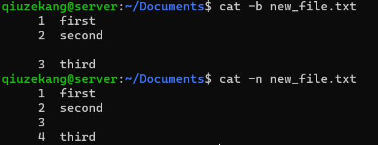

==**head**==

1. 将一个文本文件的前5行输出到控制台。

   ```
   head -5 文件名
   ```

==**tail**==

2. 将一个文本文件的后5行输出到控制台。

   ```
   tail -5 文件名
   ```

   

   

==**more**==

**原理讲解：**

- more命令不是将文本的内容一次性全部给输出。而是只占控制台若干行的空间，只在这个空间里显示。用鼠标滑轮向上滚动能看到之前的别的命令。因此 more命令不会像vim那样的程序，一下占用整个命令行窗口作为文本显示器那样。

    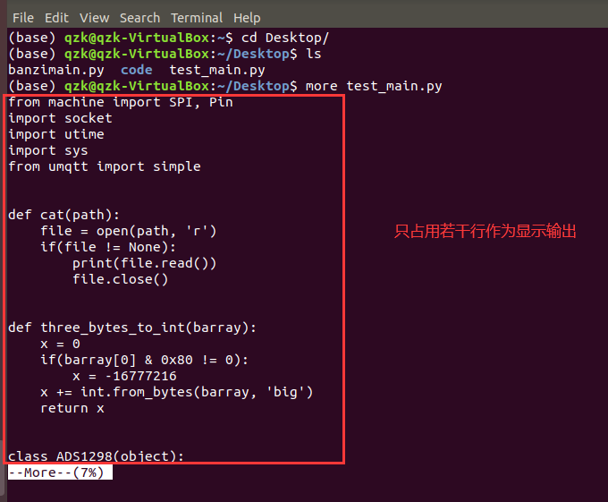

   需要说明的是，远程打开命令行的话，由于命令行窗口显示的都是服务器那边发来的文本行。那么翻页的显示的内容会累积：比如刚使用more命令打开文件时，只显示了10行文本，按 空格 后，服务器发来了后10行的文本，则当前的命令行窗口就会显示刚才的10行+新发来的10行。若此时按b到上一页，则会显示10+10+10 共30行，且第1-10行和21-30行的内容都是一样的，因为都是一页的。

   因此就是说，远程连接命令行窗口的话，不是固定的行数在显示。

- 显示的时候在右下角会有提示当前显示空间显示的文档的哪个位置的内容。

    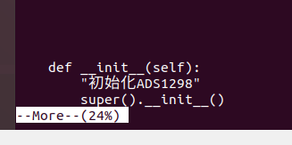

- more命令之后：

  - 按空格下面翻页。
  - 按字母b向前翻页，应该是back的意思吧。
  - 按回车向前翻页一行。
  - 按q 结束查看。此外，若再最后一页再向后翻一页，则也会结束文档的查看。

- 综上：more命令就是用于查看 内容较多的文本文件。因为内容较多的文本文件，一次性使用cat命令全部输出出来，太多行了。使用more可一点点看。

**练习：**

1. 使用more命令打开一个内容较大的文本文件，并向下翻页和向上翻页。

   ```bash
   more 文件名
   按下空格键  # 向下翻页
   按下字母b键  # 向上翻页
   ```

2. 使用more命令打开一个内容较大的文本文件，并向按行向下翻动。

   ```bash
   more 文件名
   按下enter键  # 按行向下翻动
   ```

3. 使用more命令打开一个内容较大的文本文件，不断向下翻页/翻行，直到内容显示完自动退出more命令。

   ```bash
   more 文件名
   不断按空格/回车，知道内容显示玩，再按一次就退出more了
   ```

==**less 程序**==

**原理讲解：**

- less是一个程序。可以类比与vim理解。当退出之后，命令行窗口没有留下文件中的内容。

- less比more能强大一些，但less不显示当前阅读区所在文档的百分比。

- less命令之后：

  - 按空格下面翻页。

  - 按字母b向前翻页，应该是back的意思吧。

  - 可按键盘的上下键进行按行上下翻页。

  - less可以很好的支持搜索内容：输入`/xxx`，然后按下回车可在当前文档中搜索xxx内容。搜索内容后 输出小写n，可聚焦到下一个匹配的关键字处；输入大写N可以跳到上一个匹配的关键字处。注意，当前聚焦的关键字处，是窗口的第一行。

     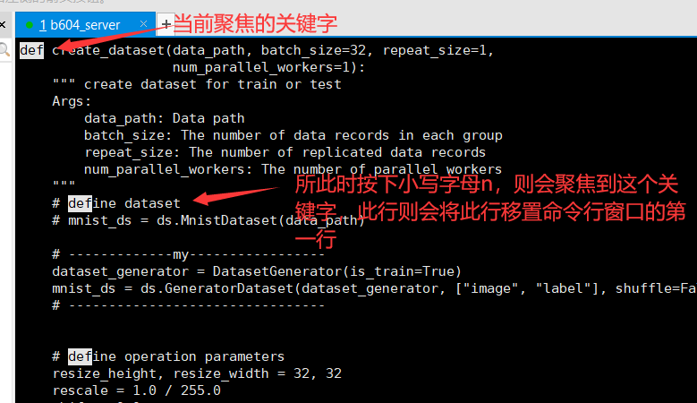

    按下小写字母n后就会变成这样。

     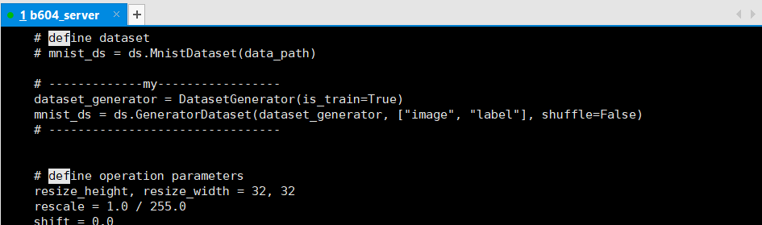

  - 按字母q可以退出less程序。

- 最后：感觉less比more更有用一些吧，熟练掌握less。

**练习：**

1. 使用more命令打开一个内容较大的文本文件，并向下翻页和向上翻页。

   ```bash
   less 文件名
   按下空格键  # 向下翻页
   按下字母b键  # 向上翻页
   ```

2. 使用less命令打开一个内容较大的文本文件，并向按行向下和向上翻动。

   ```bash
   less 文件名
   按↓键  # 按行向下翻页  
   按↑键  # 按行向上翻页
   ```

3. 使用less命令打开一个内容较大的文本文件，并搜索文本中的某个关键词，然后聚焦到文档中此关键词的下一处，再聚焦到文档中此关键词的上一处。

   ```bash
   less 文件名
   输入 /xxx 并按enter  # xxx为搜索的内容
   输入n  # 聚焦到文档中此关键词的下一处
   出入N  # 聚焦到文档中此关键词的上一处
   ```

4. 使用less命令打开一个内容较大的文本文件，然后退出less程序。

   ```bash
   less 文件名
   输入q  # 退出less程序
   ```

5. 使用less命令打开一个内容较大的文本文件，要求可以显示行号。

   ```bash
   less -N 文件名  # N必须是大写
   ```

 

## 三 用户管理

1. 创建一个新用户，指定附属组。

   ```bash
   useradd -m qiuzekang -s /bin/bash -G sudo   
   
   解释：
   # -m 表示创建用户名的时候，同时创建在home目录为用户创建一个文件夹。
   # -s 表示用户用户登录的
   # -g指定其组。如果没有-g，则用户会属于一个名为用户名的组。
   # -G指定其附属组。
   ```

2. 修改用户的密码。

   ```bash
   passwd 用户名
   
   解释：
   # 输入以下命令后，系统会让输入两遍新密码
   ```


## 四 磁盘管理

1.  查看所有

   ```
   df -lh  
   ```

2. 查看指定文件夹大小

   ```bash
   du -sh 文件夹
   ```

   

