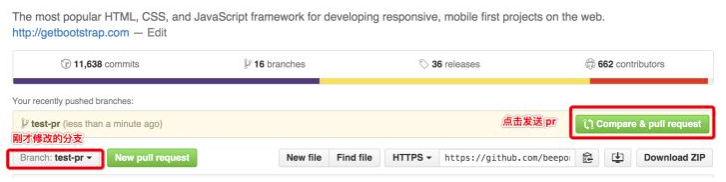

# Git

[官方网站](https://git-scm.com/)

## 相关教程

[Git教程|菜鸟教程](https://www.runoob.com/git/git-tutorial.html)
## git待学习

 下图来自狂神说的图：


**缓存区**

> 在QQ浏览器的`开发待看`收藏夹有三条关于git的博客，可以看一看应该就能懂了。


- [ ] git流程，文件的状态
- [ ] git冲突
- [ ] git分支
- [ ] git与ssh


## - .gitignore没有用

并不是只要在.gitignore中写了的文件，就会被忽略。如果文件已经交由git管理，再将该文件名添加到gitignore中，git还是会控制管理这文件。因此，在将项目弄成一个git项目之前就要先将gitignore写好。这样就ok。


## - windows下，管理git的密码

在控制面板中找到如下东西：          即可点进去即可修改。


## - 将本地 项目/文件 推送到coding的一个项目中

```git
step1: 在coding上创建项目

step2: 将本地仓库和远程仓库关联并推送到远程仓库

【1】
先写好 .gitignore文件

【2】
git init   #初始化git项目
git add .  #添加所有文件到本体仓库
git commit -m "First commit"    #提交到本地仓库

git remote add origin <url>   #与远端仓库进行关联
git push -u origin master     #推送到远端
```


## - pull request

首先要知道，该操作是github的，而不是git的。

我尝试用类比的方法来解释一下 pull reqeust。想想我们中学考试，老师改卷的场景吧。你做的试卷就像仓库，你的试卷肯定会有很多错误，就相当于程序里的 bug。老师把你的试卷拿过来，相当于先 fork。在你的卷子上做一些修改批注，相当于 git commit。最后把改好的试卷给你，相当于发 pull request，你拿到试卷重新改正错误，相当于 merge。

当你想更正别人仓库里的错误时，要走一个流程：

> 1. 先 fork 别人的仓库，相当于拷贝一份，相信我，不会有人直接让你改修原仓库的
>
> 2. clone 到本地分支，做一些 bug fix
>
> 3. 发起 pull request 给原仓库，让他看到你修改的 bug
>
> 4. 原仓库 review 这个 bug，如果是正确的话，就会 merge 到他自己的项目中

**总的来说就是先checkout一下，再commit一下。-**

至此，整个 pull request 的过程就结束了。

理解了 pull request 的含义和流程，具体操作也就简单了。以 Github 排名最高的 [https://github.com/twbs/bootstrap](https://link.zhihu.com/?target=https%3A//github.com/twbs/bootstrap) 为例说明。

> 1. **先点击 fork 仓库，项目现在就在你的账号下了**
>
> 
>
> 2. **在你自己的机器上 git clone 这个仓库，切换分支（也可以在 master 下），做一些修改。**
>
>    ```
>    ~  git clone https://github.com/beepony/bootstrap.git
>    ~  cd bootstrap
>    ~  git checkout -b test-pr
>    ~  git add . && git commit -m "test-pr"
>    ~  git push origin test-pr
>    ```
>
> 3.   **完成修改之后，回到 test-pr 分支，点击旁边绿色的 Compare & pull request 按钮**
>
>    
>
> 4.  **添加一些注释信息，确认提交** 
>
>    
>
> 5. **仓库作者看到，你提的确实是对的，就会 merge，合并到他的项目中** 


## - 重新编写gitignore

直接修改gitignore是不会生效的，需要先去掉已经托管的文件，修改完成之后再重新添加并提交。

**第一步：**

> git rm -r --cached .
> 去掉已经托管的文件


**第二步：**

> 修改自己的.gitigonre文件内容	


**第三步：**

> git add .
> git commit -m "clear cached"


## **- 取消add**

> 
>
> 使用`git reset HEAD`命令，则取消刚才的add。
>
> 

## **- 取消commit**

1. 什么情况需要 取消commit：某次提交的本地仓库后，觉得这次提交不适合push到远程仓库，则需要回退本次提交，重新进行提交。
2. 取消commit的话，使用`git reset HEAD`没用。
3. **解释：**假设commit之后，本地仓库变成v6.0。commit之后，本地仓库更新，HEAD就是指向这个v6.0版本。此时暂存区其实也存的是v6.0版本的信息。此时`git reset HEAD`表示将暂存 恢复成HEAD指向的版本呢，即恢复成v6.0版本，当然是没用的。
4. 若想取消本次commit，需要用`git reset HEAD~1`。表示暂存区恢复到本地仓库的 当前HEAD指向的版本的旧一个版本，即恢复成版本v6.0的前一个版本。


## - gitignore大全

### idea项目

```
# Built application files and Maven
target/
pom.xml.tag
pom.xml.releaseBackup
pom.xml.versionsBackup
pom.xml.next
release.properties
dependency-reduced-pom.xml
buildNumber.properties
.mvn/timing.properties
 
# Compiled class files
*.class
 
# Log Files
*.log
 
# About IntelliJ
*.iml
/.idea/
/out/
 
# BlueJ files
*.ctxt
 
# Mobile Tools for Java (J2ME)
.mtj.tmp/
 
# macOS
.DS_Store
 
# Package Files
*.jar
*.war
*.ear
*.zip
*.tar.gz
*.rar
 
# CMake
cmake-build-debug/
 
# File-based project format
*.iws
 
# mpeltonen/sbt-idea plugin
.idea_modules/
 
# JIRA plugin
atlassian-ide-plugin.xml
 
# Crashlytics plugin (for Android Studio and IntelliJ)
com_crashlytics_export_strings.xml
crashlytics.properties
crashlytics-build.properties
fabric.properties
 
# virtual machine crash logs, see http://www.java.com/en/download/help/error_hotspot.xml
hs_err_pid*
```

### python项目

```
# Byte-compiled / optimized / DLL files
__pycache__/
*.py[cod]
*$py.class

# C extensions
*.so

# Distribution / packaging
.Python
build/
develop-eggs/
dist/
downloads/
eggs/
.eggs/
lib/
lib64/
parts/
sdist/
var/
wheels/
*.egg-info/
.installed.cfg
*.egg
MANIFEST

# PyInstaller
#  Usually these files are written by a python script from a template
#  before PyInstaller builds the exe, so as to inject date/other infos into it.
*.manifest
*.spec

# Installer logs
pip-log.txt
pip-delete-this-directory.txt

# Unit test / coverage reports
htmlcov/
.tox/
.coverage
.coverage.*
.cache
nosetests.xml
coverage.xml
*.cover
.hypothesis/
.pytest_cache/

# Translations
*.mo
*.pot

# Django stuff:
*.log
local_settings.py
db.sqlite3

# Flask stuff:
instance/
.webassets-cache

# Scrapy stuff:
.scrapy

# Sphinx documentation
docs/_build/

# PyBuilder
target/

# Jupyter Notebook
.ipynb_checkpoints

# IPython
profile_default/
ipython_config.py

# pyenv
.python-version

# celery beat schedule file
celerybeat-schedule

# SageMath parsed files
*.sage.py

# Environments
.env
.venv
env/
venv/
ENV/
env.bak/
venv.bak/

# Spyder project settings
.spyderproject
.spyproject

# Rope project settings
.ropeproject

# mkdocs documentation
/site

# mypy
.mypy_cache/
.dmypy.json
dmypy.json

```

## 自己搭建git服务器

- [gogs](https://github.com/gogs/gogs)
- [gitea](https://github.com/go-gitea/gitea)
