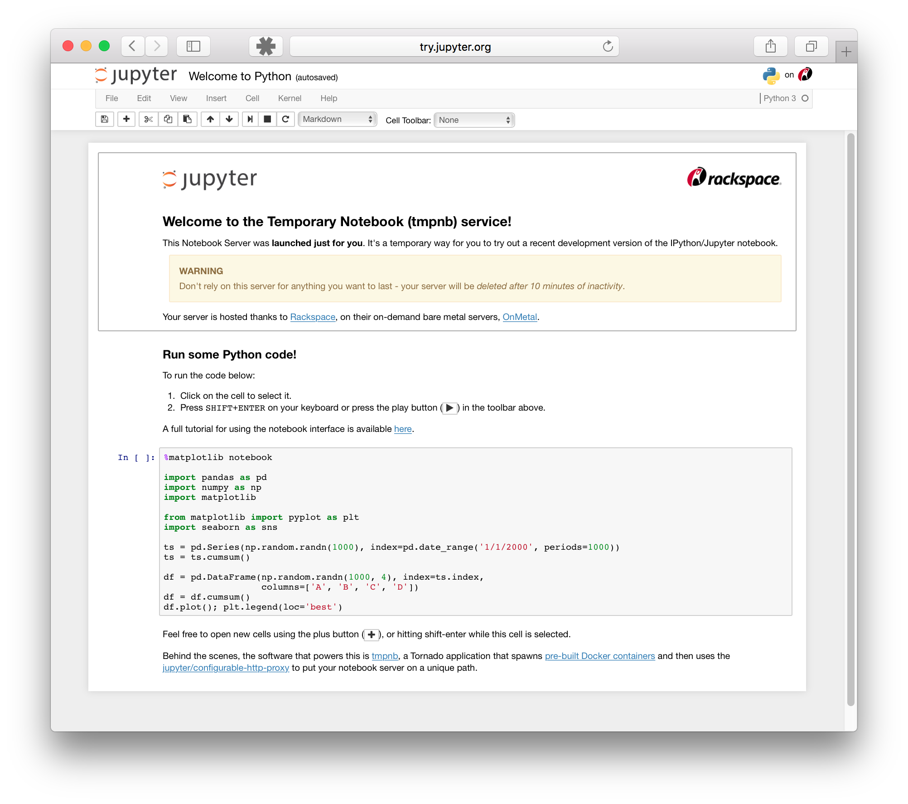

# Jupyter Notebook

交互式、笔记本式的编程环境。



## Quick Start

```bash
# 使用pip安装
pip install notebook

# 启动 Jupyter Notebook
jupyter notebook
```

- [官方网站](https://jupyter.org/)
- [官方文档](https://docs.jupyter.org/en/latest/)


## Jupyter Notebook with [VS Code](../TextEdit/VSCode.md)


