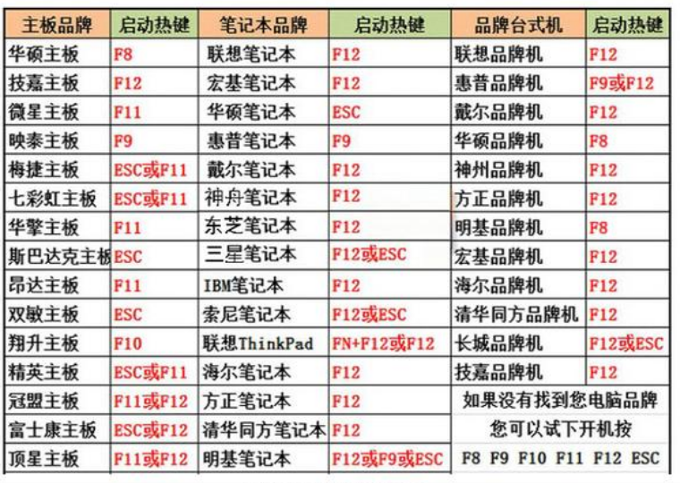
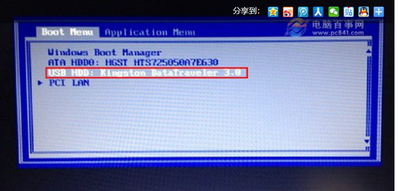
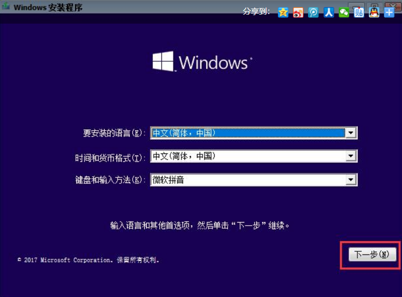
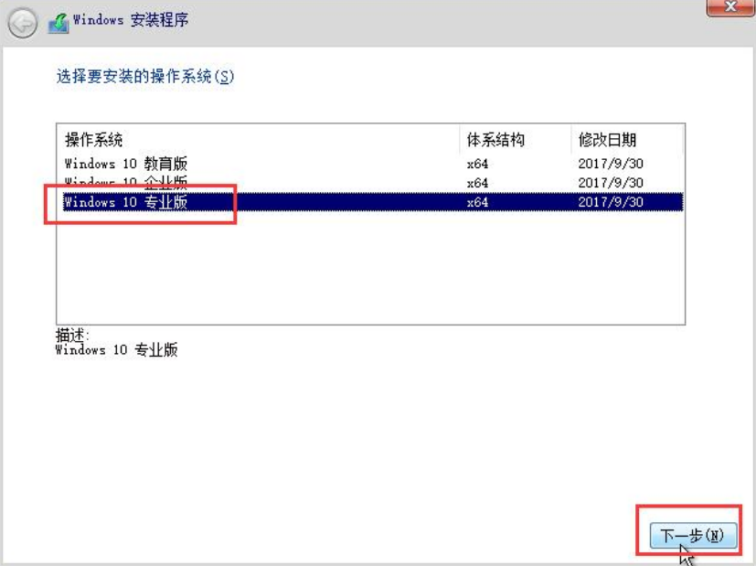
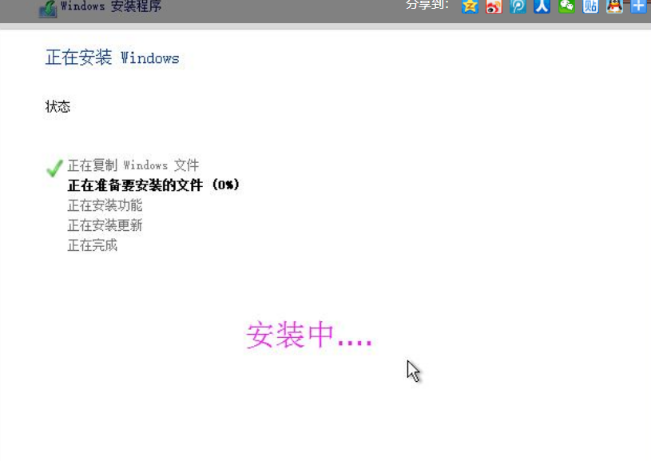
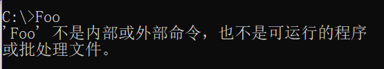
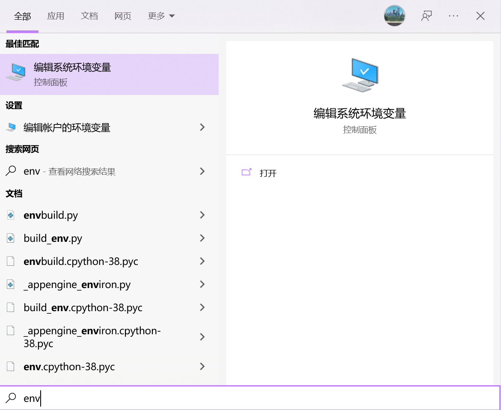

# Windows 

## Windows安装

你可以在任意一台可以联网的电脑进入[微软官方网站](https://www.microsoft.com/zh-cn/software-download/windows10)，下载最新版本的Windows 10或是引导盘制作工具。

U盘安装Win10系统整个过程分三步，虽说讲的很多，但其实操作都不难，只是为了让电脑小白用户也能看得懂，必需详细一些。

1. 制作原版系统U盘
2. 如何启动制作好的系统U盘
3. 安装win10系统

需要准备U盘一个，容量需要8GB以上（因为Win10镜像文件就超过4GB，因此U盘必须8GB或更大）

下面我们正式U盘安装Win10系统环节。

**1. 制作原版win10系统U盘。**

推荐使用微软的[Windows下载工具](https://www.microsoft.com/zh-cn/software-download/windows10)
创建安装介质（USB 闪存驱动器、DVD 或 ISO 文件），以在其他电脑上安装 Windows 10。
**注意！！！写入镜像之前，会格式化U盘。如果你U盘之前存储了重要文件，记得提前备份到其他U盘或者放在网盘或电脑硬盘中，否则会出现数据丢失。**

**2. 设置U盘启动，开机时从U盘引导。**

将U盘制作成启动盘，并写入Windows10原本镜像后，今后这个U盘，就可以给电脑安装系统了，包括刚才我们用的这台电脑或者其它任何电脑安装系统。
不过呢？启动U盘插入电脑，重启电脑默认不会进入系统安装界面，而是直接进入系统。这主要是因为，电脑默认是从硬盘启动的，而 不是U盘启动，因此还需要设置电脑从U盘启动，这样才能进入U盘系统安装界面。

 

目前，原版Win10系统进入U盘启动有2种方式，一种是UEFI启动，一种是传统BIOS启动，两种启动方式都可以。**电脑进入启动U盘的方法，是电脑开机后，立即马上不停的按启动键，而不是按着不动**； 

**1、UEFI启动**

UEFI启动也就是快启动，可以直接选择进入U盘安装系统。不过，不同电脑开机进入快启动的按键不同，它是根据你的[主板](http://www.ityears.com/tags/2771-0.html)或[笔记本](http://www.ityears.com/notebook/)的品牌来定的，大家可以参考下图中的表格来找出自己电脑的启动键，也可以查询百度。

**2、传统BIOS启动**

传统BIOS启动就是先进入电脑Bios设置，然后将电脑第一启动项由默认的 硬盘 设置改成 U盘，并保存并退出，之后重启电脑就可以直接进入U盘系统安装界面了。

不管是BIOS还是UEFI，只要能运行到U盘就行。

**3. 安装系统**

设置电脑从U盘启动之后，接下来就可以看到Win10初始化安装界面了。

1. Win10初始安装界面，一般默认是简体中文，直接点击下一步即可，如图所示。

2. 接下来选择Win10系统版本，一般建议选择专业版。当然，如果您有家庭版的序列号，那就选家庭版，之后再点下一步，在继续下一步中，选择“自定义安装”，如图所示。 

3. 然后就开始安装了，等待自动重启数次即可。

## Windows命令行

### Windows环境变量

#### 什么是环境变量

环境变量，简单的说就是把一串字符赋给一个变量名，通常，这串字符代表的含义是一个或一些目录的地址。

如环境变量``Path``就以分号为间隔定义了一些目录，这些目录所构成的字符串就是环境变量的值。

环境变量中的``Path``中，可以看到有一堆的路径，当我们在命令行中输入命令时，Windows就会在这些目录中寻找对应的可执行程序。
所以，当出现Command Not Found Error时，往往是因为我们没有在``Path``中添加所请求的可执行程序的路径。

在Windows下，常见的可以执行命令的文件类型有：``*.exe``, ``*.cmd``, ``*.bat``, ``*.ps1``  等。

#### 添加环境变量

按``Win``键调出搜索框，输入"env"，一般搜索结果的前两个就是环境变量管理器。

可以看到，我们可以设置系统环境变量和账户环境变量，两者的区别在于，系统环境变量对所有账户生效，而账户变量只对当前账户生效，一般而言，**设置账户的环境变量就能满足需求，如非必要，尽量不要设置系统环境变量**。

